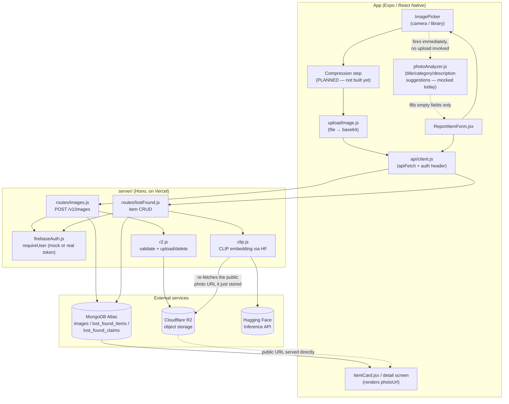
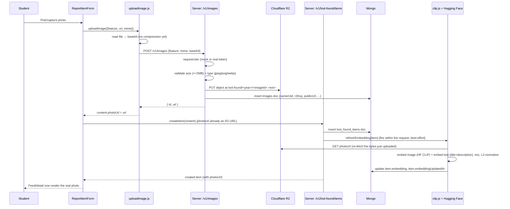
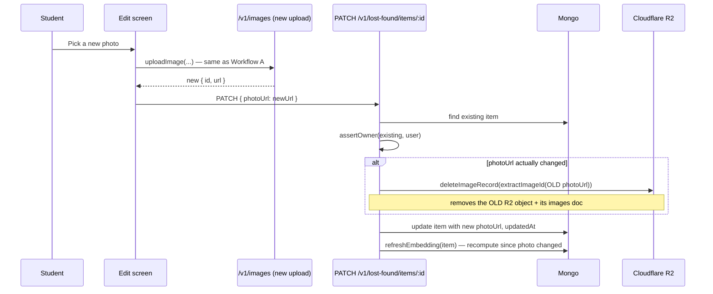
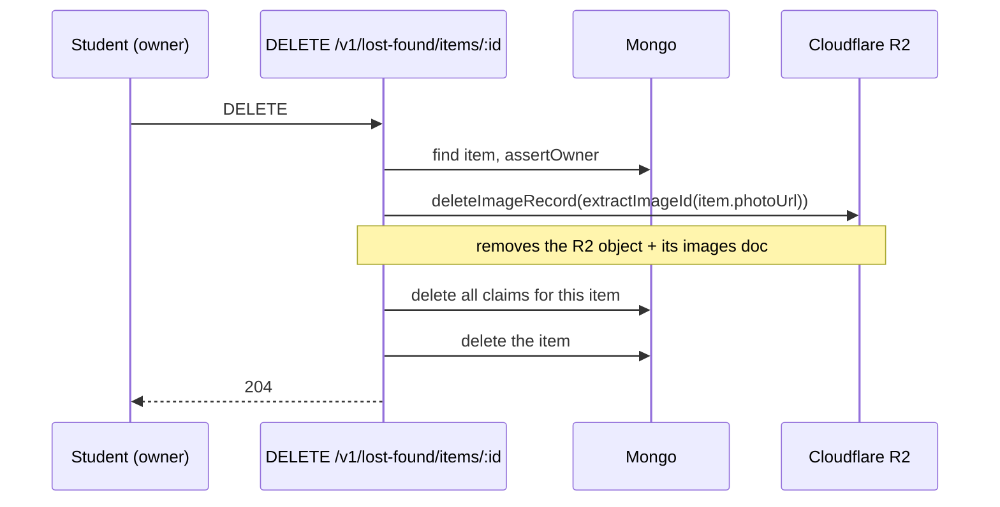

# Lost & Found — Image Pipeline: Architecture & Workflow

Companion to [lost-found-production-roadmap.md](./lost-found-production-roadmap.md).
That document says *what* needs to change; this one documents *how the
pipeline actually works today* — every component, every hop, and exactly
where each known gap sits in the flow — so the roadmap's phases can be
read against a concrete picture instead of a list of file names.

Scope note, per [rules.md](../rules.md): this describes the pipeline as
built on the existing Mongo/R2/Atlas infrastructure. Nothing here proposes
changing that infrastructure or the item persistence model — only how
images move through it.

---

## 1. Components



**Client side**

| Piece | File | Responsibility |
|---|---|---|
| Picker | `src/lostFound/ReportItemForm.jsx` | Camera/library permission + capture, holds `photoUri` in form state |
| Compression | *(planned, Phase 1 of the roadmap)* | Not built yet — see §8 |
| Uploader | `src/lib/media/uploadImage.js` | Reads the local file, base64-encodes it, calls the API |
| Autofill analyzer | `src/lib/lostFound/photoAnalyzer.js` | Suggests title/category/description from the photo — currently mocked, see §6 |
| API client | `src/lib/api/client.js` | Attaches the auth header (mock or real), wraps `fetch`, normalizes errors |
| Renderer | `src/lostFound/ItemCard.jsx`, item detail screen | Renders `photoUrl` as an image, falls back to a colour block when empty |

**Server side** (`server/`, a Hono app deployed to Vercel)

| Piece | File | Responsibility |
|---|---|---|
| Auth middleware | `firebaseAuth.js` | Resolves the caller's identity — either the mock bridge (`Bearer mock:<uid>`, gated by `ALLOW_MOCK_AUTH`) or a real Firebase ID token |
| Images route | `routes/images.js` | Decodes the upload, validates it, stores it, returns `{ id, url }` |
| Items route | `routes/lostFound.js` | Item CRUD; also the place that triggers embedding refresh |
| R2 helper | `r2.js` | Type/size validation, R2 key naming, put/delete against the bucket |
| CLIP helper | `clip.js` | Calls Hugging Face's inference API to embed an image + its title/description |

**External services**

- **Cloudflare R2** — actual photo bytes live here, served from a public URL (`R2_PUBLIC_BASE_URL`).
- **MongoDB Atlas** — three collections involved: `images` (upload metadata), `lost_found_items` (the `photoUrl` and `embedding` fields live here), `lost_found_claims` (unaffected by images).
- **Hugging Face Inference API** — computes the CLIP embedding used later for matches; not involved in the upload path itself, only in what happens right after an item is created or edited.

---

## 2. Data model

**`images` collection** — one doc per uploaded file, written by `routes/images.js`:

```json
{
  "_id": "1f2e...(imageId, a uuid)",
  "feature": "lost-found",
  "ownerUid": "mock-user",
  "r2Key": "lost-found/2026/1f2e....jpg",
  "publicUrl": "https://<r2-public-base>/lost-found/2026/1f2e....jpg",
  "mime": "image/jpeg",
  "byteSize": 842013,
  "createdAt": "2026-09-14T10:00:00.000Z"
}
```

**`lost_found_items`** — the relevant fields for the image pipeline:

```json
{
  "photoUrl": "https://<r2-public-base>/lost-found/2026/1f2e....jpg",
  "embedding": [512 floats] | null,
  "embeddingUpdatedAt": "2026-09-14T10:00:01.500Z"
}
```

The two collections are linked only implicitly: `extractImageId()` in
`routes/images.js` recovers an `images._id` by pattern-matching the R2 URL
shape out of `lost_found_items.photoUrl`. There is no foreign key —
cleanup depends on that regex match succeeding, which is worth knowing
when reasoning about failure modes (§8).

---

## 3. Workflow A — Posting a new item with a photo



Key thing this diagram makes visible: **the photo upload and the item
creation are two separate API calls**, not one atomic operation. The photo
exists in R2 and in the `images` collection *before* the item that will
reference it exists at all. That ordering is exactly why an orphaned R2
object is possible (§8) — if the upload succeeds but `createItem` never
happens (network drop, app closed, validation failure), the image and its
metadata doc are left behind with nothing pointing at them.

The embedding refresh is also worth calling out: it happens by the server
**re-downloading the same photo it just stored**, from the public R2 URL,
then sending those bytes to Hugging Face. That means CLIP matching has a
hard runtime dependency on the R2 bucket actually being publicly
reachable at `R2_PUBLIC_BASE_URL` — if that URL isn't actually public,
`fetchImageBytes` silently returns `null` and the item ends up with no
embedding, which is indistinguishable from "not embedded yet" unless
someone checks the server logs.

---

## 4. Workflow B — Editing an item's photo



The old photo is deleted only *after* the new one is already uploaded —
so a failed edit never leaves an item with no photo at all, but it does
mean the old and new photo briefly coexist in R2. That's a reasonable
tradeoff (safety over storage cost) and not flagged as a gap.

---

## 5. Workflow C — Deleting an item



Straightforward and already correctly ordered — image cleanup happens
before the item itself is gone, so a mid-failure can't strand a
now-unreferenceable image with no way to find it again.

---

## 6. Workflow D — Generating a title / category / description from the photo

This is a separate system from everything above, and it's worth being
precise about that: Workflows A–C are about getting the photo *file* into
R2. This one is about getting *text* out of the photo to help the student
fill in the form — and, separately again, from the CLIP embedding in
Workflow A, which produces a similarity vector, not any human-readable
text. Three different things look at the same photo for three different
reasons; none of them currently talk to each other.

```mermaid
sequenceDiagram
    participant U as Student
    participant F as ReportItemForm
    participant PA as photoAnalyzer.js
    participant HF as (real vision API — not wired yet)

    U->>F: pickFromCamera() or pickFromLibrary()
    Note over F: onPressPhoto() uses Alert.alert to offer\nthe Camera/Library choice — a no-op on web,\nso this entry point doesn't work in a browser today
    F->>F: onPickedPhoto(uri) → persistPickedPhoto(uri)
    F->>F: setPhotoUri(uri); runAnalysis(uri) — starts immediately,\nbefore the photo is ever uploaded anywhere
    F->>PA: analyzePhoto(uri)
    alt active backend is "local" or "api" (the only ones actually used today)
        PA->>PA: mockAnalyzePhoto() — 1.2s fake delay,\nreturns the next of 5 canned {title, category, description}\nguesses from a fixed list, cycling regardless of the photo
    else active backend is "firestore" (unused stub, never the active one)
        PA->>HF: realAnalyzePhoto() — TODO, not implemented,\nthrows unconditionally
    end
    PA-->>F: { suggestedTitle, suggestedCategory, suggestedDescription }
    F->>F: fill title/category/description ONLY if each field is still empty
    F-->>U: shows "Auto-filled from your photo — review and edit before posting"
```

**How it works today, precisely:**

- The moment a photo is picked, `runAnalysis(uri)` fires immediately —
  this happens client-side only, before the photo has been uploaded to R2
  or the item has been created. No network call happens today, because
  the result is entirely canned.
- `analyzePhoto()` in `src/lib/lostFound/photoAnalyzer.js` branches on
  `useLostFoundBackend()`. It only ever calls the "real" path when the
  active backend is `'firestore'` — which is a stub, unused, and not one
  of the two backends actually running (`local` or `api`). In practice,
  every real session today gets `mockAnalyzePhoto()` regardless of which
  backend is active for items/images.
- `mockAnalyzePhoto()` waits ~1.2 seconds to simulate latency, then
  returns the next entry from a fixed 5-item array
  (`CANNED_GUESSES`), advancing a module-level counter each call. The
  suggestion has nothing to do with the actual photo's pixels — a photo of
  keys can come back suggesting "Grey hooded sweatshirt" if that's next in
  the cycle.
- The result only fills a field that's still empty
  (`prev.trim() ? prev : result.suggestedTitle`, same pattern for category
  and description) — so it never overwrites something the student already
  typed, and the UI is explicit that it's a suggestion to review, not a
  final answer.
- `realAnalyzePhoto()` is a stub that unconditionally throws
  `'photoAnalyzer: real analysis not implemented.'` — it's not partially
  built, it's a placeholder with a `TODO` describing the intended shape:
  upload the image, call a real vision/captioning API, map its response
  into the same `{ suggestedTitle, suggestedCategory, suggestedDescription }`
  shape the mock already returns.

**Gaps specific to this workflow (not yet fixed, flagging rather than deciding):**

- **No real implementation exists.** Building one means choosing an actual
  vision/captioning service and how it maps to `suggestedTitle` /
  `suggestedCategory` / `suggestedDescription` — for example, an image
  captioning model could produce `suggestedTitle`/`suggestedDescription`,
  while `suggestedCategory` could instead reuse CLIP zero-shot
  classification against the fixed category list already used elsewhere
  in this pipeline. That's a real architectural choice (which service,
  what it costs, whether it reuses the CLIP setup already wired for
  matches or is fully separate) and isn't decided here.
- **Even a finished `realAnalyzePhoto()` would never run today**, because
  the branch in `analyzePhoto()` only reaches it for the `firestore`
  backend. Wiring a real implementation would also require updating that
  condition to cover whichever backend(s) it should actually apply to.
- **The entry point to this whole flow may be broken on web.**
  `onPressPhoto()` presents the Camera/Library choice via `Alert.alert`,
  which — per this project's own standing lesson — is a no-op on
  `react-native-web`. If that's still the case, a web session can't even
  open the picker to trigger analysis in the first place; this needs to be
  confirmed by actually tapping "Add a photo" in a web session, not
  inferred from the native-looking code path.

---

## 7. What's actually doing the "seeing" — the vision/ML stack

Checked directly, not assumed: every dependency in both `package.json`
files (root app and `server/`) was listed out. There is no OpenCV, no
YOLO/YOLOv8 or any other object-detection model, no OCR library (no
Tesseract, no cloud OCR API), and no on-device ML runtime (no
TensorFlow.js, ONNX Runtime, Core ML, or ML Kit) anywhere in this codebase.
`expo-image-picker` only captures/selects a file — it doesn't inspect it.

There is exactly **one real model in the entire project**, and it's used
for exactly one of the two things a reader might assume it's used for:

| | Uses a real model? | What it is | What it produces |
|---|---|---|---|
| **Matches (Workflow A's embedding refresh)** | **Yes** | **CLIP** (`openai/clip-vit-base-patch32`), called remotely via the **Hugging Face Inference API** from `server/src/clip.js` — no model runs on this server or on-device; it's a plain HTTPS `fetch` sending image bytes (and, separately, the item's title+description text) to Hugging Face's hosted endpoint | A 512-dimension embedding vector per item (image vector and text vector, weighted 0.7/0.3 and L2-normalized) — a position in similarity space, compared via cosine similarity in Atlas. **Not** a label, not a caption, not a bounding box. |
| **Autofill (Workflow D)** | **No** | Nothing — `mockAnalyzePhoto()` is a hardcoded list of 5 canned guesses and a `setTimeout` | The same 5 guesses, cycling in a fixed order, regardless of what's actually in the photo |

So to answer directly: **nothing is currently analyzing image *content* for
the autofill feature at all** — not YOLO, not OpenCV, not OCR, not even a
simple heuristic like a colour histogram or reading EXIF data. The only
place an actual vision-capable model touches this pipeline is CLIP, and
its job is narrowly "is this image similar to that one," not "what is in
this image" or "what text does this image contain."

**Decided:** real autofill (replacing §6's mock) will use a **single
free-tier provider — Google Gemini (Flash), via Google AI Studio.** One
structured call returns `suggestedTitle` / `suggestedCategory` /
`suggestedDescription` with per-field confidence, and, in the same call,
a best-effort `detectedText` for anything clearly readable in the photo —
this is the "maximum accuracy, structured, not a raw dump" requirement in
practice: the model does the structuring, not a downstream parser, and
one capable multimodal call covers the ID-card/document text-reading case
too, rather than needing a second dedicated OCR system alongside it.

This is a revision of an earlier "hybrid: LLM + separate OCR service"
plan, made after [rules.md](../rules.md)'s Rule 8 (free-tier-first,
minimal footprint) was added — a second vendor integration wasn't actually
necessary once "OCR" is recognized as something a good multimodal model
already does as part of one call, not a capability gap requiring its own
system. Gemini specifically was picked over Hugging Face (already
carrying this project's CLIP load on its own free, rate-limited tier —
adding a second feature onto the same quota risked contention between the
two) and over OpenAI/Anthropic (no standing free API tier, trial credits
only).

**Known limit, accepted rather than engineered around:** Gemini's free
tier caps at roughly 10 requests/minute project-wide (not per student) and
250–1,500/day depending on model/project age. Per-image token cost
(~300 tokens) is trivial against the 250K/minute token cap — the request
rate is the only real ceiling, and it's comfortable at current pilot scale
(dummy auth, one campus). A burst of simultaneous submissions is the one
scenario that could hit it; the `status: "failed"` value in the schema
below already degrades gracefully in that case.

**Data-handling tradeoff, made deliberately:** Google's free-tier terms
note that submitted prompts/images may be used to improve their products,
and advise against uploading sensitive personal data — relevant here
because documents/ID-card photos can carry a student's name and roll
number. Decision: treat them like any other photo for now, given auth is
still dummy and this is a small pilot; revisit specifically if the project
moves toward real users/production auth at scale.

**Still deferred, not cancelled:** a dedicated OCR fallback (e.g.
Tesseract.js — free, self-hosted) if Gemini's built-in text reading proves
insufficient for real ID-card photos in practice. That's the "later,
minimal" expansion path per Rule 8 — see the roadmap's Phase 4.

### Target shape for a real result (draft — depends on the technology choice above)

Whichever technology gets picked, the requirement is the same: a
**structured** result the form can bind field-by-field, never a raw blob
of extracted text handed to the student to untangle. A draft shape, to
ground that requirement concretely rather than leaving it abstract:

```json
{
  "suggestedTitle": "Black backpack with a front pocket",
  "suggestedCategory": "accessories",
  "suggestedDescription": "A black backpack, front zip pocket, worn corners.",
  "confidence": { "title": 0.82, "category": 0.91, "description": 0.76 },
  "detectedText": null,
  "status": "ok"
}
```

Notes on why each field is there, so this reads as a requirement and not
just a shape:

- `suggestedCategory` must be one of the app's existing fixed category ids
  (`electronics`, `documents`, `clothing`, `accessories`, `books`, `keys`,
  `other`) — never a free-text label the form has no slot for.
- `confidence` per field is what makes "maximum accuracy" checkable rather
  than a vibe — it's also what a real implementation needs in order to
  decide when to fall back to `status: "low_confidence"` or
  `"failed"` instead of presenting a guess as if it were certain.
- `detectedText` comes from the same Gemini call, asked to report any
  clearly readable text in the photo (§7) — `null` when there's nothing
  to read, populated for documents/ID cards and anything else with visible
  text, with no separate OCR call needed.
- `status` (`ok` / `low_confidence` / `failed`) is what lets the form
  distinguish "here's a confident suggestion" from "couldn't analyze
  this, please fill it in yourself" — the mock today has no such state,
  because it never fails.

This shape is a draft to make the requirement concrete, not a commitment —
the real fields will depend on what the chosen model can actually produce.
See the roadmap's Phase 4 for the work this unlocks once a technology is
picked.

---

## 8. Where the current gaps sit in this architecture

Mapping the roadmap's known gaps onto the diagrams above, precisely:

- **No compression (Workflow A, step "read file → base64")** — this is the
  single box in the diagram that doesn't exist yet. Everything downstream
  of it (the 2 MB check in `r2.js`) is already correct; it's just that
  most real camera photos will fail that check today because nothing
  shrinks them first.
- **Mime detection guessed from the URI, not the picker's real `mimeType`**
  — happens inside `uploadImage.js`, before the request ever leaves the
  device. Wrong here means the wrong `Content-Type` is stored on the R2
  object and in the `images` doc, silently.
- **Orphaned R2 objects** — structurally possible whenever Workflow A's
  first call (upload) succeeds but the second call (`createItem`) doesn't.
  Nothing in this architecture currently reconciles that; it would need
  either a rollback (delete the image if item creation fails) or a
  periodic sweep of `images` docs with no matching `lost_found_items.photoUrl`.
  Worth deciding which approach fits before building it, rather than
  picking one silently.
- **Never verified with a real device end to end** — this isn't a
  component gap, it's a verification gap: every arrow in Workflow A has
  been read from the code, not watched happen. That's exactly what the
  roadmap's Phase 2 checklist is for.
- **`GET /v1/images/:id` proxy** exists in `routes/images.js` but doesn't
  appear anywhere in Workflows A–C — items store the raw R2 URL directly,
  never the proxy path. It's drawn out of the diagrams above deliberately
  because nothing in the traced flow currently calls it.
- **Photo autofill (Workflow D) is fully mocked today**, independent of
  everything else in this doc — see §6 for the specifics. It's the one
  piece of the image pipeline where "extract information from the photo"
  doesn't happen at all yet, canned guesses stand in for it.

---

## 9. What changes once the roadmap's Phase 1 fixes land

Only two things move in this picture — nothing about the server, R2, or
Mongo changes:

1. A **Compress** step gets inserted between "pick photo" and "read file →
   base64" in Workflow A (and implicitly in Workflow B, since it reuses
   the same upload path).
2. `uploadImage.js` starts reading `mime` from the picker's own asset
   metadata instead of guessing from the URI string.

Everything from the `POST /v1/images` call onward is unchanged — which is
also why these are low-risk fixes: they tighten what arrives at an
already-correct server boundary, rather than changing the boundary itself.
